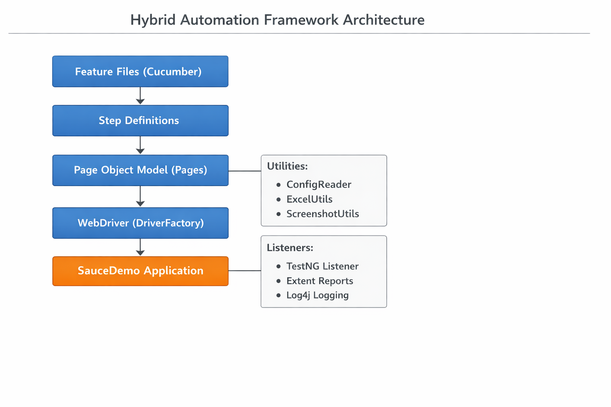

\# Hybrid Automation Framework – SauceDemo

\#\# Project Overview  
This project demonstrates a Hybrid Test Automation Framework using Selenium, TestNG, Cucumber (BDD),  
and Page Object Model (POM) to automate the SauceDemo web application.

\#\# Tech Stack  
\- Java  
\- Maven  
\- Selenium WebDriver  
\- TestNG  
\- Cucumber (BDD)  
\- Apache POI (Excel Data Driven Testing)  
\- Extent Reports  
\- Log4j  
\- GitHub

\#\# Application Under Test  
SauceDemo    
Automated Modules:  
\- Login  
\- Logout  
\- Add to Cart  
\- Checkout (In Progress)

\#\# Framework Type  
Hybrid Framework (BDD \+ TestNG \+ POM \+ Data Driven)

\#\# Folder Structure
src/main/java
├── base
├── config
├── drivers
├── listeners
├── utils
└── pages

src/test/java
├── hooks
├── runners
├── stepdefinition
└── tests

src/test/resources
├── features
├── testdata
├── config.properties
└── log4j.xml

## Framework Architecture Diagram

